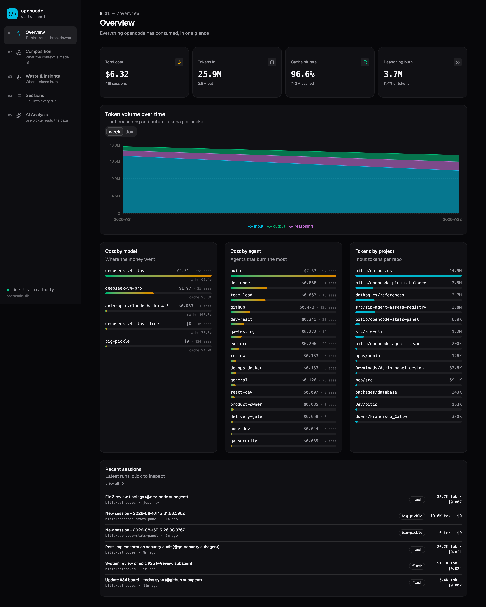
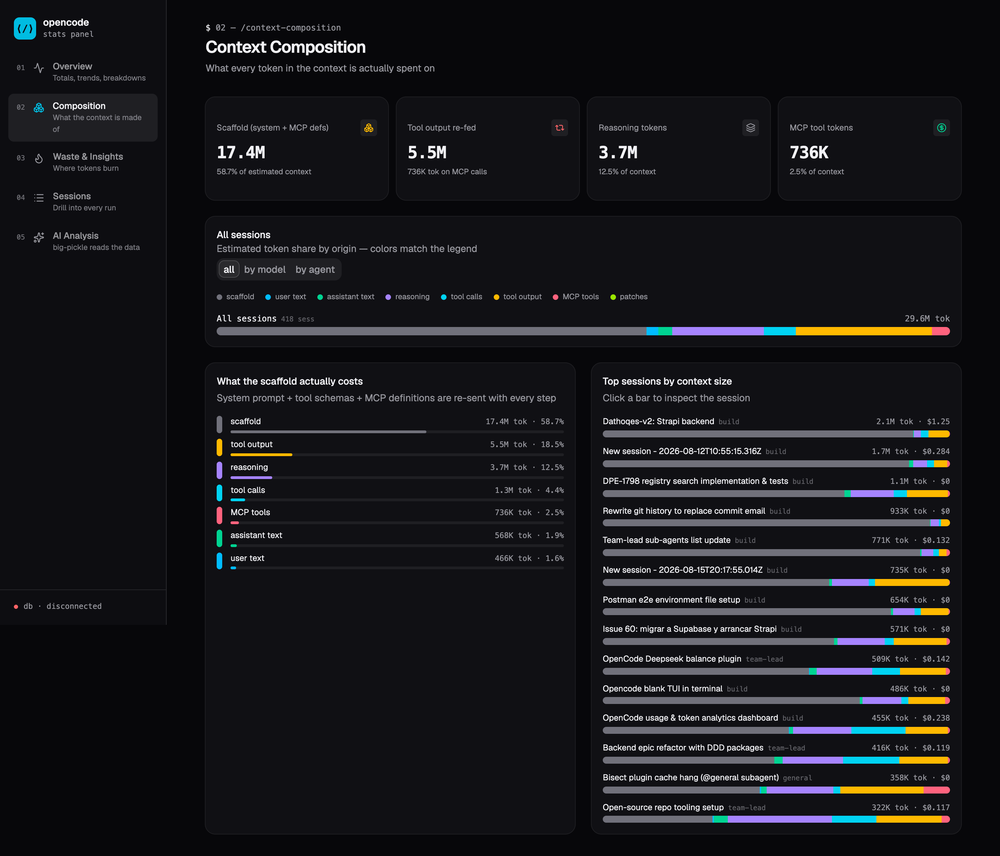
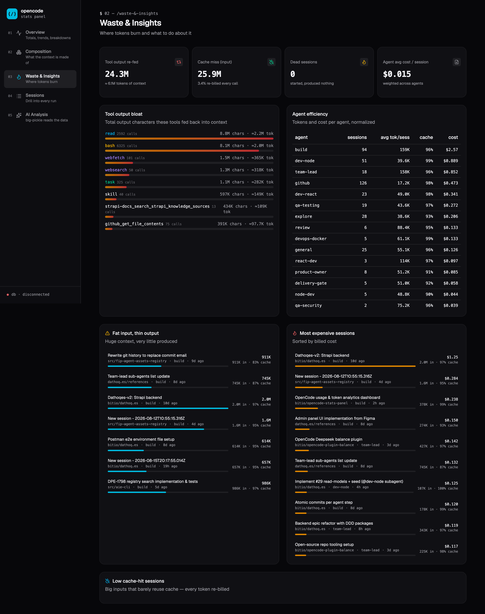
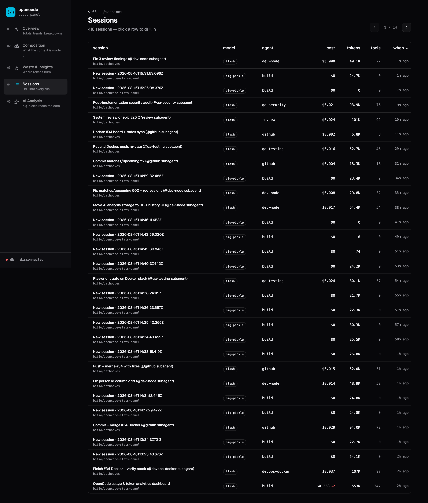
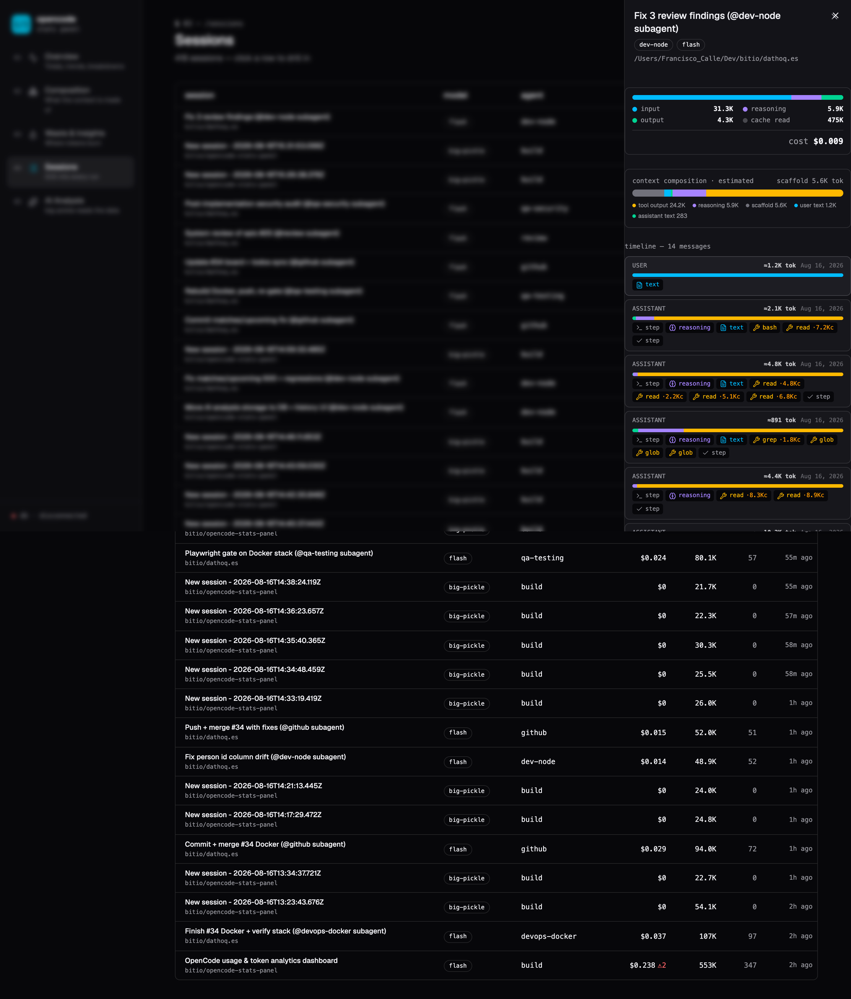
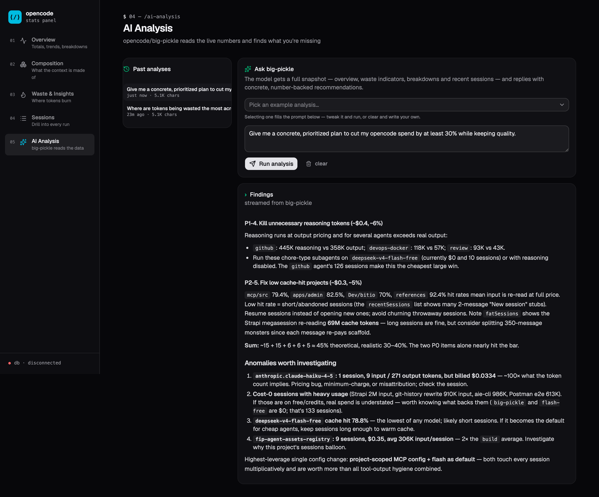

# opencode-stats-panel

Local dashboard for analyzing opencode usage — tokens, cost, cache efficiency, waste, and an AI-powered analyst on top.

## Stack

- **Frontend**: React 19 + Vite + TypeScript + shadcn/ui (dark, terminal-inspired)
- **Backend**: Express + better-sqlite3 (read-only access to opencode's live DB)
- **AI analysis**: shells out to `opencode run -m opencode/big-pickle` (Opencode Zen), streams the reply via SSE

## Features

- **Overview** — KPI cards (cost, tokens, cache hit rate, reasoning burn), token-volume time series, cost/agent/project breakdowns, recent sessions.
- **Composition** — what the context is actually made of: estimated token share by origin (user/assistant text, reasoning, tool calls, tool output, MCP calls, patches) plus the **scaffold** — the system prompt + tool schemas + MCP definitions re-sent every step (typically ~60% of context). Per-model/agent views and per-session stacked bars; the session drawer shows the same breakdown per message.
- **Waste & Insights** — tool-output bloat (read/bash re-feeding context), cache misses, fat-input/thin-output sessions, dead sessions, agent efficiency, most expensive sessions.
- **Sessions** — sortable/paginated table with a drill-down drawer (token mix, context composition, per-message breakdown, tool calls, errors).
- **AI Analysis** — big-pickle reads a live snapshot (including context composition) and returns number-backed recommendations, streamed as markdown and saved to a local history.

## Pages

Screenshots below are captured against a real usage dataset (stored in `docs/screenshots/`).

### 01 — Overview

Landing page for the whole picture: how much you spent, how many tokens you pushed through each model, and where it went.



- **KPI cards** — total cost, tokens in, cache hit rate, and reasoning burn (the % of context spent on chain-of-thought).
- **Token volume over time** — stacked area chart of input, reasoning and output tokens per week (or per day via the tab); cache-read volume is the faint band underneath.
- **Cost by model / agent** and **tokens by project** — proportional bars. The cache-hit percentage shown per model tells you how much reuse each model gets.
- **Recent sessions** — the latest runs; click one to open the drill-down drawer.

### 02 — Composition

Estimates what the context sent to the models is actually made of. The DB doesn't store per-message token counts, so content sizes are estimated from characters (≈4 chars/token); the **scaffold** is the remainder of `tokens_input` after subtracting the content — i.e. the system prompt, tool schemas and MCP definitions that are re-sent every step.



- **KPI strip** — the four headline numbers: scaffold, tool output re-fed, reasoning, and MCP tool tokens.
- **Per-model / per-agent stacked bars** — switch scope with the tabs to compare how different models/agents build their context.
- **Category table** — what the scaffold actually costs, ranked.
- **Top sessions by context size** — click any bar to open that session's drawer.

### 03 — Waste & Insights

The "where do tokens burn" page — the actionable findings.



- **Tool output bloat** — total characters that `read`, `bash`, `grep`, etc. fed back into context (the single biggest reclaimable source).
- **Agent efficiency** — sessions, avg tokens/session, cache hit and cost per agent.
- **Fat input, thin output** — sessions with huge context that produced very little.
- **Most expensive sessions** and **low cache-hit sessions** — click any to inspect.

### 04 — Sessions

Every session in a sortable, paginated table. Click a row to open the drill-down drawer.



- Sort by **cost**, **tokens**, or **when** (asc/desc via the column headers).
- Rows show model, agent, cost (with a ⚠ error badge when tool calls failed), total tokens and tool-call count.
- **Session drawer** — token mix bar, the session's context composition, and a per-message timeline where each message shows its own mini composition bar and estimated tokens.



### 05 — AI Analysis

Ask Opencode Zen (`opencode/big-pickle`) to read the live numbers and come back with recommendations.



- **Example analyses** — pick a pre-built prompt (token waste, cache health, scaffold & MCP bloat, model value, agent strategy, cut the bill, expensive sessions, dead sessions) to fill the prompt box, tweak it, and run.
- **Streaming markdown output** — the reply renders as markdown as it streams; the "thinking…" indicator covers the ~10–20s warm-up before the first token.
- **Past analyses** — every completed run (query + answer + model + timestamp) is stored in `data/analysis.db` and listed on the left. Click one to reload it; hover the trash icon to delete.

## Getting started

```bash
npm install
npm run dev
```

`npm run dev` starts the API on `:8787` and Vite on `:5173` (API proxied under `/api`).

- `OPENCODE_DB=/path/to/opencode.db npm run dev` — point at a different DB (default `~/.local/share/opencode/opencode.db`).
- `OPENCODE_STATS_MODEL=opencode/claude-sonnet-4-6 npm run dev` — different analysis model.

## Install as a command: `oc-stats`

Install a `oc-stats` launcher into `~/.local/bin` so you can open the panel from anywhere (works on macOS and Linux):

```bash
./install.sh
```

`install.sh` builds the frontend and writes a `oc-stats` script that starts the **backend server** (which also serves the built UI) at `http://localhost:8787`. Stop it with `Ctrl-C`.

- `OC_STATS_BIN=/other/bin ./install.sh` — install into a different directory instead of `~/.local/bin` (make sure it's on your `PATH`).
- Requires `npm install` to have been run already.

## How it reads the DB

The backend opens the live opencode.db **read-only** (`query_only` pragma). SQLite's WAL mode allows concurrent readers, so opencode can keep writing while the dashboard reads. Every query is a fresh read, so numbers always reflect the latest sessions — hit refresh for new data.

Analysis history is stored separately in a **writable** SQLite DB at `data/analysis.db` (gitignored) — set `OPENCODE_STATS_DB=/path/to/analysis.db` to relocate it. `npm run dev` auto-creates it on first run.

## Notes

- `.bin/npm` is a shim that strips `--allow-scripts` (npm 12 rejects that flag in project installs, but the global `~/.npmrc` `allow-scripts` entry makes `npx shadcn` pass it). Run shadcn adds via `PATH="$PWD/.bin:$PATH" node node_modules/shadcn/dist/index.js add <component>`.
- The `shadcn`/`tailwindcss`/`better-sqlite3`/`fsevents` entries in `package.json#allowScripts` are npm 12's sanctioned way to permit those packages' install scripts.
